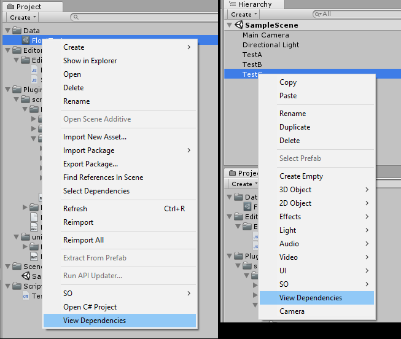
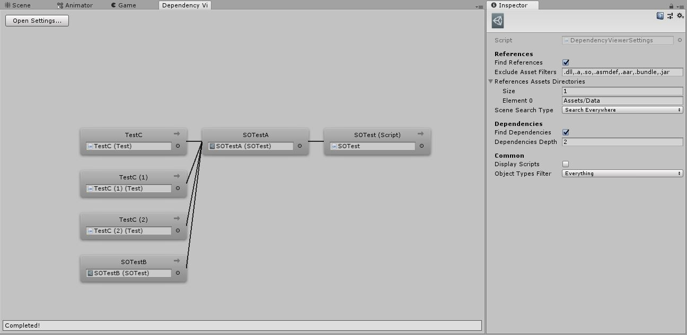

# Unity Dependency Graph Viewer
Visual graph in editor to see dependencies/references of an asset on Unity (based on UE4 reference viewer)

# "Roadmap"
* New cache system for fast search:

  * Find references/dependencies on common assets: OK
  * Find references/dependencies on prefabs: OK
  * Find references/dependencies on scenes (without loading the scene): OK
  * Build all sync and async (with operation status): OK
  * Build one Object only: OK
  * Watch file changes and rebuild only these files: In Progress
  * Save/load of cache (JSON into EditorPrefs): Waiting
  * Put namespace everywhere: Waiting
  * Couple cache system with the node tree: Waiting
  * Remove old system: Waiting
  * Optimization of Unity's common assets (not browse all properties): Waiting
  * Find references/dependencies on UnityEvents: Waiting
  * Optimization of the overall search by parsing file instead of loading objects (need performance tests): Waiting
  * Find references/dependencies on Animation/Animator/Timeline assets: Waiting

* UnityEvent Method Search:

  * Find GameObjects using UnityEvents from a method name: Waiting

  

# How to
Just select a GameObject or any asset in the Project window, right click > View dependencies.
Once the window is opened, you can navigate between dependencies by clicking on the little arrow on each node.

# Screenshots

